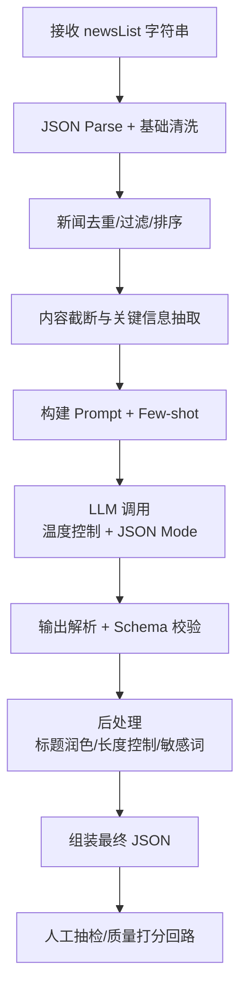

# 大盘总结 工作流与提示词设计

> 产品：自选早晚报（Morning/Evening Newsletter）
> 模块：大盘总结（Market Overview Summary）
> 目标：基于多条市场新闻，用 LLM 提炼高质量、结构化、适合用户阅读的「大盘总结」

---

## 1. 输入输出契约

### 1.1 输入（Input）

```json
{
  "newsList": "[{\"newsId\":\"1211\",\"title\":\"1111\",\"content\":\"1111\",\"publishTime\":\"\",\"publisher\":\"\"}]"
}
```

- `newsList` 为 **JSON 字符串**（注意是字符串而非数组）
- 每条新闻字段：
  - `newsId`: 唯一ID
  - `title`: 标题
  - `content`: 正文（可能较长）
  - `publishTime`: 发布时间（可能为空）
  - `publisher`: 来源（可能为空）

### 1.2 输出（Output）

```json
{
  "summary": "",
  "newsId": "",
  "title": "",
  "publishTime": "",
  "publisher": ""
}
```

- `summary`: **核心字段**，存放大盘总结的完整正文（建议 300-600 字，结构清晰）
- `newsId`: 可使用输入中最具代表性的 newsId，或生成合成ID（如 `summary_{date}_{hash}`）
- `title`: 本期大盘总结的标题（吸引人、准确、信息密度高）
- `publishTime`: 建议使用当前生成时间或取新闻列表中最晚时间
- `publisher`: 可固定为 "AI大盘总结" / "自选早晚报" / 来源聚合

---

## 2. 示例分析框架（待用真实示例填充）

当你提供 3 篇参考生成结果后，按以下维度拆解：

| 维度           | 分析要点                                      | 典型发现（示例后填写） |
|----------------|-----------------------------------------------|------------------------|
| 标题风格       | 长度、信息密度、是否带情绪/数据/结论          |                        |
| 开头段落       | 是否直接给核心结论？是否先描述指数？          |                        |
| 结构层次       | 是否分段？是否使用「1. 2. 」或小标题？        |                        |
| 数据引用       | 如何处理点位、涨跌幅、成交额、涨跌家数？      |                        |
| 驱动因素归因   | 政策/资金/外围/行业事件 的权重和写法          |                        |
| 板块/风格      | 是否必须提强弱板块？如何简洁有力？            |                        |
| 情绪与风险     | 风险提示、情绪描述的克制程度                  |                        |
| 结尾           | 是否给展望/操作建议？语气如何？               |                        |
| 长度与密度     | 字数、句子复杂度、信息/字比                    |                        |
| 归因准确性     | 是否严格基于输入新闻，避免幻觉                |                        |
| 个性化适配     | 是否适合「自选」用户（不推荐具体股票？）      |                        |
| 语气           | 专业、中性、略带温度 vs 生硬                  |                        |

**当前状态**：示例尚未提供。设计将基于通用金融早晚报最佳实践先行构建，收到示例后立即校准。

---

## 3. 推荐工作流（Pipeline）



### 3.1 阶段说明

1. **解析与清洗**
   - 解析 `newsList` 字符串为数组
   - 过滤空 content / 极短新闻
   - 按 `publishTime` 降序排序（最新在前）
   - 去重（标题相似度 > 0.85 或内容相似）

2. **上下文构建**
   - 总 token 预算控制（建议单次 < 12k~16k tokens）
   - 每条新闻截断（title 保留 + content 前 600-800 字）
   - 重要性预打分（可选）：用轻量模型或规则给每条新闻打分，优先高分新闻

3. **LLM 生成**
   - 使用结构化输出（JSON mode / tool calling / constrained generation）
   - 温度：0.3 ~ 0.5（事实性总结不要太 creative）
   - Top-p: 0.9

4. **校验与修复**
   - 强制字段非空
   - summary 长度区间检查（建议 250-800 字）
   - 幻觉检测简单规则：数字必须来自输入、禁止编造具体股票推荐
   - 若失败：重试（最多 2 次）+ 降级策略（返回保守版本）

5. **后处理**
   - 标题生成/润色（可单独再调一次 LLM 做 title）
   - 敏感词/合规过滤
   - publishTime 统一格式（ISO 或 YYYY-MM-DD HH:mm）

---

## 4. 提示词设计（核心）

### 4.1 System Prompt（建议）

```markdown
你是一位资深A股市场策略分析师，负责为「自选早晚报」撰写专业、客观、结构清晰的大盘总结。

核心原则：
1. 严格基于用户提供的新闻列表进行总结，禁止编造任何未出现在新闻中的数据、事件或结论。
2. 突出「大盘」视角：指数表现、资金流向、板块轮动、宏观政策、外围影响、整体情绪。
3. 不推荐具体个股，不给买卖建议，只做市场层面的逻辑与风险提示。
4. 语言专业、克制、简洁有力，适合有一定投资经验的用户阅读。
5. 输出必须是严格的 JSON，字段含义见下方。

输出字段定义：
- summary: 完整的大盘总结正文，使用自然段落组织，必要时可使用「•」或编号增强可读性。长度控制在 350-650 字。
- title: 12-22 字的标题，要包含核心结论或关键数据，吸引人但不夸张。
- newsId: 若新闻列表中存在最具代表性的一条新闻，使用其 newsId；否则使用 "summary_" + 当前日期。
- publishTime: 使用当前生成时间，格式 YYYY-MM-DD HH:mm:ss。
- publisher: 固定使用 "自选早晚报 · 大盘总结"。

禁止事项：
- 禁止出现具体股票代码或股票名称推荐。
- 禁止出现「强烈推荐」「必涨」「抄底」等绝对化表述。
- 禁止虚构成交量、点位、外资流入等具体数字（除非新闻中明确给出）。
```

### 4.2 User Prompt 模板（带 CoT）

```markdown
当前日期：{{current_date}}
新闻列表（共 {{news_count}} 条，已按时间倒序排列）：

{{#each news}}
【ID: {{newsId}} | 来源: {{publisher}} | 时间: {{publishTime}}】
标题：{{title}}
正文：{{content}}
---
{{/each}}

请按以下思考步骤完成任务：

步骤1：通读所有新闻，识别出影响「大盘整体」的最核心 3-5 个驱动因素。
步骤2：判断今日/本期市场情绪基调（偏强 / 中性 / 偏弱），并找到支撑该判断的关键证据。
步骤3：提取板块与风格线索（资金关注的方向、强弱分化）。
步骤4：归纳短期风险点或需持续观察的变量。
步骤5：撰写 summary（必须严格基于以上事实）。
步骤6：为本次总结起一个准确且有信息密度的标题。

现在请直接输出符合以下 JSON Schema 的结果，不要添加任何额外解释：

{
  "summary": "string",
  "newsId": "string",
  "title": "string",
  "publishTime": "string",
  "publisher": "string"
}
```

### 4.3 Few-shot 示例位置

当你提供 3 篇优质示例后，我会把它们整理成 1-shot / 2-shot / 3-shot 形式，放在 User Prompt 之前，显著提升风格一致性。

---

## 5. JSON Schema（推荐用于结构化输出）

```json
{
  "$schema": "http://json-schema.org/draft-07/schema#",
  "type": "object",
  "required": ["summary", "newsId", "title", "publishTime", "publisher"],
  "properties": {
    "summary": {
      "type": "string",
      "minLength": 200,
      "maxLength": 1200,
      "description": "大盘总结正文"
    },
    "newsId": {
      "type": "string",
      "minLength": 1
    },
    "title": {
      "type": "string",
      "minLength": 8,
      "maxLength": 40
    },
    "publishTime": {
      "type": "string",
      "pattern": "^\\d{4}-\\d{2}-\\d{2} \\d{2}:\\d{2}(:\\d{2})?$"
    },
    "publisher": {
      "type": "string",
      "minLength": 1
    }
  },
  "additionalProperties": false
}
```

---

## 6. 质量评估维度（用于打分或人工 review）

1. **事实忠实度**（0-10）：是否所有关键事实均来自输入？
2. **大盘视角**（0-10）：是否聚焦整体而非个股/单一事件？
3. **结构清晰度**（0-10）：段落组织、逻辑递进。
4. **信息密度**（0-10）：是否有用信息 vs 废话比例。
5. **标题质量**（0-10）：准确性 + 吸引力 + 长度。
6. **风险克制**（0-10）：是否避免了误导性表述？
7. **语言专业度**（0-10）：是否像资深策略师写的？

目标：单条总分 ≥ 42 / 50。

---

## 7. 工程实现建议

### 7.1 调用伪代码

```ts
async function generateMarketSummary(newsListStr: string) {
  const newsList = safeParse(newsListStr);
  const cleaned = preprocess(newsList);
  
  const prompt = buildPrompt(cleaned);
  
  const raw = await llm.chat({
    system: SYSTEM_PROMPT,
    user: prompt,
    temperature: 0.35,
    responseFormat: { type: 'json_object' }
  });

  let result = safeJsonParse(raw);
  
  // 校验 + 重试逻辑
  if (!validateMarketSummary(result)) {
    result = await retryWithLowerTemp(prompt);
  }

  result.publishTime = result.publishTime || formatNow();
  result.publisher = result.publisher || '自选早晚报 · 大盘总结';

  return result;
}
```

### 7.2 推荐模型（2026 年视角）

- 主力：Claude 3.5 / 4 Sonnet、GPT-4o、Gemini 2.5 Pro、Qwen2.5-72B、DeepSeek-V3
- 结构化输出能力强的优先
- 成本敏感可考虑 Qwen2.5-32B / 72B + 蒸馏

### 7.3 缓存与一致性

- 相同 newsList hash 24h 内可缓存结果（便于 A/B 测试）
- 引入「版本化提示词」管理（prompt_version 字段）

---

## 8. 待办（收到示例后立即执行）

- [ ] 接收并编号 3 篇示例
- [ ] 按第 2 节框架逐条拆解
- [ ] 提取「好」的语言模式、结构模板
- [ ] 补充 1-3 个 Few-shot 到提示词
- [ ] 调整 summary 目标长度、标题风格
- [ ] 补充特定领域规则（例如：北向、两融、期指等）
- [ ] 编写单元测试 prompt（golden set）

---

## 9. 版本历史

- v0.1 (2026-06-26): 初始设计，基于输入输出契约 + 金融早晚报最佳实践先行构建
- v0.x: 待根据真实示例迭代

---

**下一步行动**：请提供那 3 篇参考的生成结果示例。我会立即进行结构拆解，并产出校准后的最终提示词 + 工作流。
